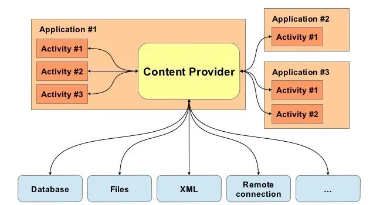

# Android Architecture

Created: July 15, 2022 2:29 PM
Type: Architecture

# Architecture and How Apps Run

## Android Basics

- Android is based on the Linux Operating System.
    - Your Android phone can take commands just like any Linux device
    - Is, cd, rm, etc.
    - Permissions to folders and applications are dependent on the Linux Operating System file permission model
- Android apps are usually written in Java and compiled to Dalvik bytecode, which is somewhat different from the traditional Java bytecode. Dalvik bytecode is created by first compiling the Java code to .class files, then converting the JVM bytecode to the Dalvik .dex format with the `d8`tool.
- The current version of Android executes this bytecode on the Android runtime (ART). ART is the successor to Android's original runtime, the Dalvik Virtual Machine (DVM). The key difference between Dalvik and ART is the way the bytecode is executed.

## Dalvik Virtual Machine

- In the DVM, bytecode is translated into machine code at execution time, a process known as *just-in-time* (JIT) compilation. This enables the runtime to benefit from the speed of compiled code while maintaining the flexibility of code interpretation.

<aside>
💡 JIT, or Dynamic Translation, is compilation that is being done during the execution of a program. Meaning, at run time, as opposed to prior to execution. JIT compilation attempts to use the benefits of static compilation and interpreter. While the interpreted program is being run, the JIT compiler determines the most frequently used code and compiles it to machine code.

</aside>

- Dalvik was the original runtime VM, and is still referenced to by the name Dalvik bytecode
- Dalvik is not utilized in modern Android OS, and has been replaced by the ART

### Android Runtime (ART)

- This is the modern translation layer from the application's bytecode to device instructions.
- Every application is run in a virtual machine known as the Android Runtime
- ART uses a hybrid combination of *ahead-of-time*(AOT), JIT and profile-guided compilation. Apps are recompiled on the device when they are installed, or when the OS undergoes a major update. While the code is being recompiled, device-specific and advanced code optimizations techniques can be applied. The final recompiled code is then used for all subsequent executions.

<aside>
💡 Notes : Android apps don't have direct access to hardware resources, and each app runs in its own virtual machine or sandbox.

</aside>

## Application Sandbox

- Each Android app lives in its own security sandbox.
- The Android operating system is a multi-user Linux system in which each app is a different user.
- By default, the system assigns each app a unique Linux user ID (the ID is used only by the system and is unknown to the app). The system sets permissions for all the files in an app so that only the user ID assigned to that app can access them.
- Each process has its own virtual machine (VM), so an app's code runs in isolation from other apps.
- By default, every app runs in its own Linux process. The Android system starts the process when any of the app's components need to be executed, and then shuts down the process when it's no longer needed or when the system must recover memory for other apps.
- The Android system implements the *principle of least privilege*. That is, each app, by default, has access only to the components that it requires to do its work and no more. This creates a very secure environment in which an app cannot access parts of the system for which it is not given permission. However, there are ways for an app to share data with other apps and for an app to access system services:
    - It's possible to arrange for two apps to share the same Linux user ID, in which case they are able to access each other's files. To conserve system resources, apps with the same user ID can also arrange to run in the same Linux process and share the same VM. The apps must also be signed with the same certificate.
    - When two apps are signed with the same certificate and explicitly share the same user ID (having the *sharedUserId* in their *AndroidManifest.xml* files), each can access the other's data directory.
    
    ```xml
    <manifest xmlns:android="http://schemas.android.com/apk/res/android"
      package="com.android.nfc"
      android:sharedUserId="android.uid.nfc">
    ```
    
    - An app can request permission to access device data such as the device's location, camera, and Bluetooth connection. The user has to explicitly grant these permissions.

### Identify and Access Management

- As mentioned, each application has its own user for the application.
- Installation of a new app creates a new directory named after the app package, which results in the following path: `/data/data/[package-name]`. This directory holds the app's data.
- Linux directory permissions are set such that the directory can be read from and written to only with the app's unique UID.
- Android creates a unique UID for each Android app and runs the app in a separate process. Consequently, each app can access its own resources only. This protection is enforced by the Linux kernel.
    - This user is the owner of the application directory (UID between 10000 and 999999, username similar i.e. uo_a188 for UID 10188)
    - /data/app/com.example.app - generic application data
    - /data/data/com.example.app - runtime storage of data
    - /mnt/sdcard/Android/data/com.example.app - externally stored location for runtime
    - /data/data/com.example2.app - a different app requiring different user
- The file /system/core/include/private/android_filesystem_config.h includes a list of the predefined users and groups system processes are assigned to. UIDs (userIDs) for other applications are added as the latter are installed.
- If the permissions an app requested are granted, the corresponding group ID is added to the app's process.
- This stops applications from interacting with each other unless explicitly granted permissions, or a Content Provider/Broadcast Receiver is exposed.
- Root user, system level accounts
    - Emulators w/ non-Google Play APIs allow root

## SELinux

- Security-Enhanced Linux (SELinux) uses a Mandatory Access Control (MAC) system to further lock down which processes should have access to which resources.
- SELinux operates on the principle of default denial: Anything not explicitly allowed is denied. SELinux can operate in two global modes:
    - *Permissive* mode, in which permission denials are logged but not enforced.
    - *Enforcing* mode, in which permissions denials are both logged **and** enforced.
- Android includes SELinux in enforcing mode and a corresponding security policy that works by default across AOSP. In enforcing mode, disallowed actions are prevented and all attempted violations are logged by the kernel to `dmesg` and `logcat`.
- SELinux also supports a *per-domain permissive* mode in which specific domains (processes) can be made permissive while placing the rest of the system in global enforcing mode. A domain is simply a label identifying a process or set of processes in the security policy, where all processes labeled with the same domain are treated identically by the security policy.
- Each resource is given a label in the form of `user:role:type:mls_level` which defines which users are able to execute which types of actions on it. For example, one process may only be able to read a file, while another process may be able to edit or delete the file. This way, by working on a least-privilege principle, vulnerable processes are more difficult to exploit via privilege escalation or lateral movement.

### Profiles

- Separated App Data, useful for things like BYOD
    - Work Profile, Personal Profile, Always-On VPN for certain apps.
    - Still has access to system level functions such as Wifi, Bluetooth, 4G LTE, but can have isolated aspects for Data Loss Prevention like a clipboard (copy-paste), contacts, camera, etc.
- Primary User - this is the user created first time the phone is started, always running, can only be removed by factory reset.
- Secondary User - Additional users you can add to the device, and can be created/deleted by the primary user.
- Guest user - can only be one guest user at a time, a fast way to have guest access to the phone.
- Kid Mode-Google Kids Spaces (tablets only), Profiles/Account for Kids, usually vendor specific Samsung Kid Mode.

## Architecture

- Major Layers
    - Linux kernel
    - Hardware Abstraction Layer
    - Libraries ( Native C or ART )
    - Java API layer
    - System Apps


### Linux Kernel



- Support for multiple CPU types (ARM, SoC) and 32 and 64 bit.
- Applications are explicitly told which version of the Android Runtime/API version to run on
    - In Android Manifest minSDKVersion determines what version of Android API our application can run on.
    - The higher, the better, But developers want to include the most customers possible.
- Lower SDK/Android Versions can have more  security vulnerabilities and can allow for different types of attacks on only some devices/emulators
- Access to the physical components of the Linux device are controlled by drivers.
    - Bluetooth, Camera, Microphone, Wifi, LTE, Display, etc.

### Hardware Abstraction Layer (HAL)

- Abstraction layer that allows applications to access hardware components irrespective of the device manufacturer or type.
- Allows applications to simply access "the camera", "the microphone", "the location (GPS)", Bluetooth, the touch drivers without needing specific built-in drivers or manufacturer details.

### Native C vs ART

- C and C++ is the device's native language.
    - Does not require a VM.
    - Webkit - built in web browser for the app (iFrame).
    - OpenMAX AL, OpenGL ES - UI frameworks for 2D/3D models.
- Java is often easier to code in, meaning that most developers prefer this.
    - Older apps built in Java, newer ones often built in Kotlinn.
    - Kotlin is utilized by approximately 60% of app developers for Android.

### Java API Framework

- This is often what allows you app to interact with other apps, and also the device itself as defined in the Android app.
- Content Providers A way of sharing data to other applications via a specific directory (If exported)
    - content://<app-URI>/directory
- View System utilized for making the App's UI and normalizing it.
- Managers : Manages and runs things like:
    - Notifications : app popups for reminders
    - Telephony : receiving/making calls, and opening contacts.
    - Package : managing the application package, looking for updates, ensuring integrity.
    - Location : manager of location services
    - An Activity Manager that manages the lifecycle of apps and provides a common navigation back stack

### System Application Layer

- The pre-installed applications on the Android Phone.
    - Contacts, Phone, System Settings, Text Message Apps, Camera, System Monitor, Calendar
    - Google Applications
    - Vendor Specific Apps
- Great thing about Android is you can always set a new default app to replace the vendor-supplied or system app

## Application Compilation

- Every Android Application can be reverse-engineered, rebuilt, re-signed, and re-run.
- This means an attacker can modify application functionality.
- The source code is available by using a tool like JADX-GUI or Apktool


## Application Signing

- Application signing allows developers to identify the author of the application.
    - It's done using Public key cryptography.
- On Android, application signing is the first step to placing an application in its Application Sandbox.
- The signed application certificate defines which user ID is associated with which application; different applications run under different user IDs.
- When an application (APK file) is installed onto an Android device, the Package Manager verifies that the APK has been properly signed with the certificate included in that APK.
- If the certificate (or, more accurately, the public key in the certificate) matches the key used to sign any other APK on the device, the new APK has the option to specify in the manifest that it will share a UID with the other similarly-signed APKs.
- Applications are also able to declare security permissions at the Signature protection level, restricting access only to applications signed with the same key while maintaining distinct UIDs and Application Sandboxes.
- A closer relationship with a shared Application Sandbox is allowed via the shared UID feature where two or more applications signed with same developer key can declare a shared UID in their manifest.
- Today there are three methods of verifying signatures:
    - APK Signature scheme v1, v2, and v3
    - In addition, Google implemented Google Play signing which adds unique signatures to the apps
    - keytool, jarsigner, zipalign